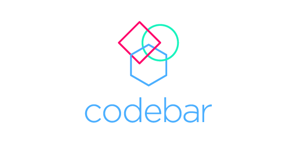

# codebar Paris

🚨 Nous cherchons des organisateurs pour lancer ce format à Paris !

➡️ Contacter @kriszta ou @kimberleycook sur le slack codebar : http://codebar.slack.com/

#### Initiative à **but non lucratif** qui organise des **ateliers de programmation** pour encourager la **diversité dans la communauté tech**.

Notre but est de permettre aux personnes peu représentées dans notre industrie d'apprendre à programmer dans un environnement bienveillant et collaboratif, pour progresser dans leur carrière.

Pour atteindre cet objectif, nous allons organiser régulièrement des ateliers gratuits visant à créer de nouvelles opportunités pour les participant·e·s en leur rendant la technologie plus accessible.

Concrètement, ce sont des ateliers d'initiation ou de perfectionnement de 2h pour environ 25 personnes, avec un ratio d'environ 1 coach pour 2 participants.

Les coachs assurent un conseil sur mesure aux participants, et l'événement est encadré par un [code de conduite](./code-of-conduct.md).

Pour participer en tant que membre de l'organisation, coach, ou participant·e, tout se fait sur le site officiel, il suffit de s'inscrire et de rejoindre le groupe de Paris : https://codebar.io/paris

Une messagerie Slack est également disponible sur https://codebar-slack.herokuapp.com avec un canal `#paris` ou vous êtes les bienvenu·e·s.

~~L'organisateur sur Paris est actuellement [Julien Bouquillon](http://twitter.com/revolunet).~~

Twitter : https://twitter.com/codebarParis

### Autres initiatives à Paris/RP :

 - http://simplon.co
 - http://jsldd.org/
 - https://codeenseine.fr/
 - https://lereset.org/
 - http://emmaus-connect.org/
 - http://www.rezosocial.org/
 - http://www.pyladies.com/locations/paris/
 - https://www.meetup.com/fr-FR/Ladies-of-Code-Paris/
 - https://www.meetup.com/fr-FR/NodeSchool-Paris/
 - https://www.meetup.com/fr-FR/rladies-paris/
 - https://www.meetup.com/fr-FR/Paris-DataLadies/
 - https://www.meetup.com/fr-FR/Women-On-Rails/
 - https://www.meetup.com/fr-FR/Women-Who-Go-Paris/
 - https://www.meetup.com/fr-FR/Duchess-France-Meetup/
 - https://www.meetup.com/fr-FR/Women-Who-Code-Paris/
 - https://www.meetup.com/fr-FR/Atelier-programmation-web-pour-debutant-Paris-15/
 - http://diversidays.com/2017/
 - https://startupbanlieue.com/

### Ailleurs :

 - http://www.hackyourfuture.net/
 - http://konexio.eu/
 - https://techfugees.com/
 
